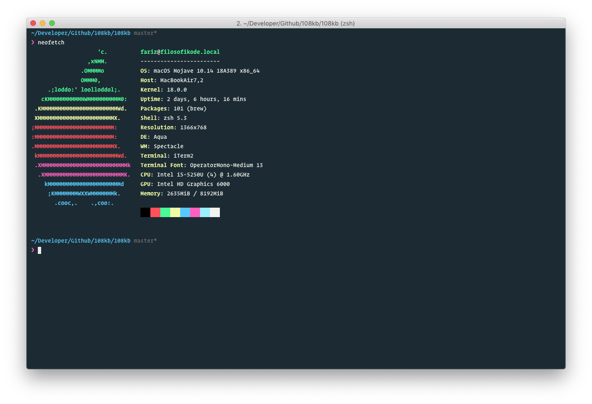
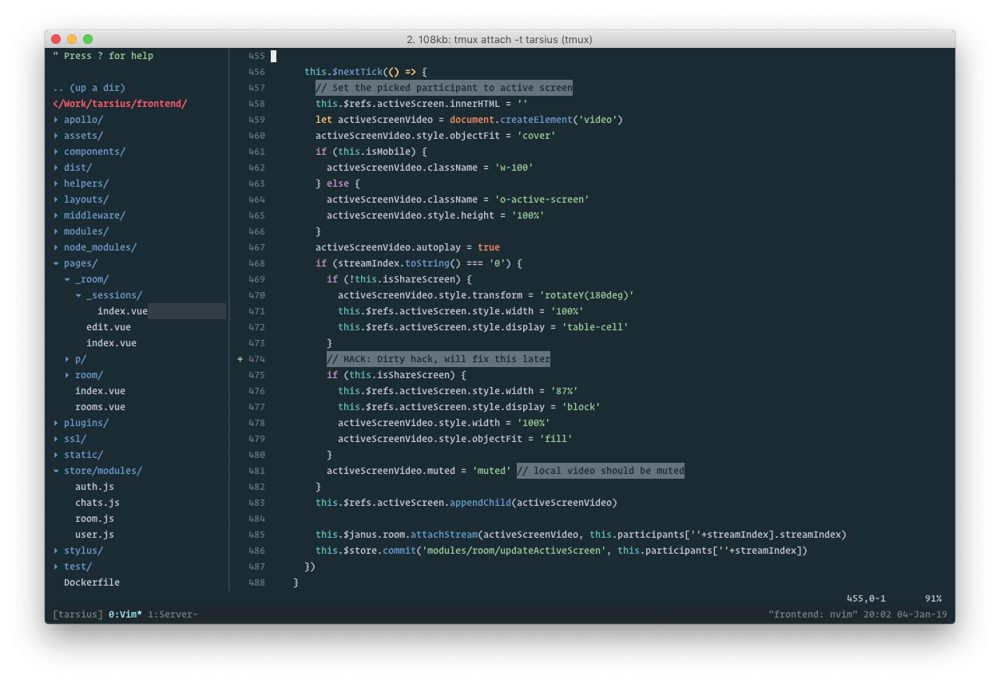

Ada yang nanya di Telegram: _Mas, peralatan untuk ngoding nya apa aja klo boleh tau?_ Meskipun beberapa sudah gue bagikan [disini](https://github.com/108kb/setup), tapi karena tidak terlalu up-to-date juga, dan kurang detail, jadi gue bagikan disini. Siapa tau butuh inspirasi, jadi semoga ter-inspirasi!

## Mesin

I work in any UNIX environment. My daily use is Mac OS X, but if only Linux in the options, it should be [Elementary](https://elementary.io). Elementary OS adalah OS favorit gue sebelum menggunakan Mac, selain elementary gue lebih suka KDE (entah mengapa gue kurang senang dengan GNOME).

Untuk server, baru gue menggunakan Ubuntu Server. I love debian family.

## Terminal

Meskipun gue seorang Frontend Engineer, tapi 80% workflow gue berada di terminal. Menggunakan terminal yang bisa dikustomisasi sesuai dengan selera gue adalah terminal favorit gue. Di Mac, gue menggunakan [iTerm](https://www.iterm2.com). Di Linux, menggunakan terminal bawaan sudah cukup menurut gue.

## Shell

Gue menggunakan ZSH, karena ekosistemnya (hello [OhMyZSH](https://ohmyz.sh)!). Enggak pernah tertarik menggunakan [Fish Shell](https://fishshell.com/) karena menurut gue UX/DX nya kurang bagus.

## Code Editor

Karena 80% workflow gue berada di terminal, code editor favorit gue adalah Vim (tapi menggunakan [NeoVim](https://neovim.io)). Gue sudah familiar dengan berbagai _command_ yang ada di Vim, sampai membuat key binding gue sendiri. Sebelumnya menggunakan VSCode, entah kenapa gue merasa lebih fokus ketika menggunakan Vim.

Sebelumnya gue menggunakan VSCode sebelum gue mengetahui bila di Vim kita bisa membuka terminal (`:tabe`, `:terminal`). Setelah mengetahuinya (gue biasanya buka terminalnya di tab baru), gue full menggunakan Vim diberbagai project. Oke mungkin di Vim tidak ada [Intellisense](https://code.visualstudio.com/docs/editor/intellisense), tapi selama menggunakan VSCode gue (tidak terlalu) merasa terbantu dengan Intellisense tersebut.

Enggak pernah tertarik untuk menggunakan Atom (walau pernah coba). Fyi, editor pertama gue adalah Notepad++ dan Sublime.

## Browser

Sebagai seorang Frontend Engineer yang peduli dengan _Cross-browser compatibility_, gue memasang banyak browser dimesin gue. Chrome, Firefox, dan Safari. Tiap browser pasti memiliki versi Developernya, engak tertarik menggunakan yang versi Canary atau Nightly Build karena males update.

Cross-browser compatibility ini sangat penting untuk Frontend Developer mengingat setiap user menggunakan browser yang berbeda-beda. Dan cara rendering, API, dll tiap browser pun berbeda-beda. Banyak pelajaran yang didapat ketika kita _development_ menggunakan browser lebih dari satu.

Usahakan menggunakan browser & versinya yang evergreen/stable. Jangan yang _outdated_, apalagi yang _canary (kecuali untuk ber-experimen)_.

## Workflow

Workflow gue simple, semuanya berada di `package.json`. Gue sedikit familiar dengan `Makefile`, tapi karena setiap hari bekerja diekosistem JavaScript, jadi mau enggak mau gue harus memaksimalkan penggunaan di `package.json`. Ketika gue merasa penggunaan di `package.json` kurang powerfull, gue lebih suka membuat custom script menggunakan bash, daripada file javascript itu sendiri (Ingin mencoba custom script menggunakan JS, tapi belum tau script apa yang harus gue buat).

Untuk penjelasan detail tentang workflow gue, gue akan membahasnya ditulisan terpisah tentang Frontend Infrastructure.

## Version Control

Seperti modern develoepr lainnya: Gue menggunakan Git. Enggak menggunakan Git GUI karena belum dapet manfaatnya haha (dulu pakai Git GUI hanya untuk kondisi conflict, karena sekarang sudah bisa cara resolvenya di CLI, so goodbye!)

## Vim Plugin

Karena gue seorang Vim User, tentu gue ingin bisa memanjakan kemalasan gue dalam menggunakan Vim sehingga bisa lebih produktif. Plugin-plugin di Vim yang gue gunakan enggak terlalu banyak, hanya:

- NerdTree: Tree explorer (File explorer)
- Deoplet: Autocomplete
- NerdTree Git Plugin: Untuk menampilkan indicator di NERDTree (jadi gue tau file mana saja yang keubah)
- Vim Fugitive: Lebih produktif menggunakan Git di Vim. Dengan bantuan custom keymap, gue bisa dengan mudah menjalankan perintah-perintah seperti `git status`, `git diff`, `git checkout`, dll tanpa harus keluar dari Vim
- Vim Wakatime: Buat iseng-iseng aja, tracking apa yang gue koding di [Wakatime](https://wakatime.com/@108kb).
- Vim GitGutter: Kalo ini ngasih indicator nya difile. Jadi gue tau dibaris berapa saja yang ada perubahan
- Vim Polygot: Syntax Highlighter. Every developers need it.
- Neoformat: Untuk kepentingan linting. Biasanya gue gunakan untuk linting dengan [`standard`](https://standardjs.com).
- Vim Reason Plus: Ini pembantu untuk ber-eksperimen dengan ReasonML
- Vim Multiple Cursors: Untuk menyeleksi Buffer lebih dari satu. Misal, gue ingin menyeleksi `className='c-Navbar'`, karena menggunakan `:%s/c-Navbar/<whatever>/gc` terlalu berbahaya, gue lebih suka menggunakan Multiple Cursors.
- Oceanic Next: My favourite themes!
- Vim Indent Guides: Untuk ngecek indent, untuk menghindari salah tutup tag biasanya.
- Language Client Neovim: Ini cara yang gue tau untuk bisa menerapkan fitur "Intellisense" di Vim. Belum terlalu maksimal menggunakan ini, kalau emang enggak terlalu berdampak ke workflow gue, nanti juga gue hapus haha.
- Vim Prettier: Penyakit klasik orang yang ngetik di Vim adalah: Indentation yang amburadul. Terlebih bila tidak menggunakan linting, atau setidaknya `.editorconfig`. Dengan Vim Prettier, gue bisa dengan mudah "nge-fix" berbagai masalah tersebut, meskipun terkadang ada beberapa fitur yang tidak sesuai dengan workflow gue sebelumnya (gue menggunakan Standard, sedangkan Prettier unopinionated). Biasanya workflow gue: `Prettier` dilanjutkan dengan `Neoformat`. Mantap.
- Fzf: Ini seperti `Cmd+p` nya Di VSCode menurut gue. Ketika gue tau file apa yang ingin gue buka, gue akan menggunakan `fzf`.

Lumayan banyak juga, ya? Selama menggunakan Vim, plugin-plugin tersebut enggak berpengaruh ke _startup time_ ketika gue membuka Vim. Untuk konfigurasi Vim gue, bisa dicek [disini](https://github.com/108kb/setup/blob/master/.vimrc). Sengaja gue membuat file-file konfigurasi gue a.k.a dotfiles dipublish secara open, jadi kalau gue ingin ganti mesin, tinggal copy saja file-file tersebut.

## Silent Hero: Tmux

Semenjak menggunakan Linux dulu, gue belum pernah tau keuntungan yang ditawarkan Tmux selain multi-window nya (multiple terminal session dalam satu window). Seiring berjalannya waktu, gue sangat terbantu ternyata dengan Tmux. Gue memisahkan penggunaan terminal (yang sebelumnya menggunakan`:tabe -> :terminal`), menjadi `Ctrl+b -> c` saja. Fitur multi sessions di Tmux a.k.a Multi-tasker nya juga berguna (gue baru tau ketika detach tmux sessions, ternyata tidak mematikan server tmux) ketika gue males nge-close tab tab yang ada di vim gue.

## Anything else?

Aplikasi-aplikasi GUI yang gue install sekarang hanya:

- Spotify (you know it)
- Telegram (you know it!!!!)
- Tweetbot (untuk main twitter)
- Kap (untuk record screen)
- 1Password (my password manager)
- Zeplin (when working with Designer)
- iTerm (my main tools)
- Reeder (untuk membaca tulisan-tulisan yang gue subscirbe RSS nya)
- Dropbox (you know it)
- Browsers (Chrome, Firefox, Firefox Dev, Safari, Safari Technology Preview, Waterfox)
- Utilities (CleanMyMac, Amphetamine, Spectacle, Alfred, Trip Mode, dan Numi)

P.S: Semua ini hanyalah tools, pembantu. Yang paling penting adalah skills & mindset, okay?

Related: [My setup (sometimes I update it)](https://github.com/108kb/setup).