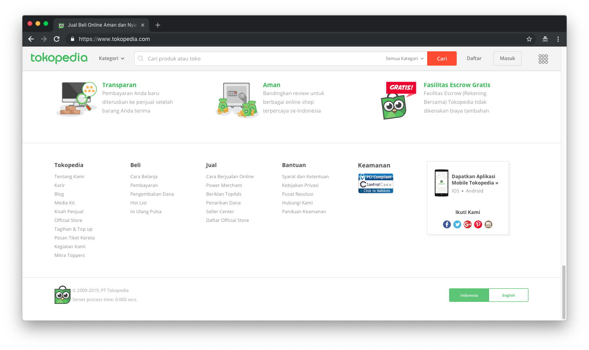

Ditulisan ini saya ingin berbagi pengetahuan saya tentang lapisan-lapisan yang ada pada suatu web app. Bila ada yang bertanya tentang pengalaman saya di dunia Web App, fyi I'm engineering User Interface since SproutCore & Extjs was cool. That's it.

Entah mengapa saya tergerak untuk berbagi tulisan ini. Meskipun setiap Web App mungkin memiliki lapisan-lapisan yang berbeda untuk end-user, namun saya rasa hampir setiap "Scalable" web app memiliki lampisan-lampisan berikut. IMO, di Frontend, Web App memiliki 5 lapisan. Saya gambar deh biar keren:

Okay I'm bad at drawing. Sengaja tidak saya beri label agar tulisan ini sedikit panjang. Lapisan yang berwarna tomato adalah apa yang dilihat oleh pengguna akhir nanti, mari kita bahas satu-satu.

Sebelumnya...

## What is Scalable in a Web App?

Hampir sama dengan pengertian _Scalable_ untuk hal apapun itu. Intinya, Scalable Web App adalah sebuah web app yang bisa menangani berbagai cakupan. Misalnya, jika sebelumnya cakupannya hanya untuk orang Indonesia, maka bila ingin mencakup lebih luas, maka seharusnya bisa dilakukan/ditangani.

Sederhananya sih gitu.

Mungkin kita sudah mengetahui tentang Horizontal dan Vertical Scaling, tapi itu bahasanya anak Backend. Karena disini kita menggunakan bahasa anak Frontend, jadi scalingnya adalah di Application Scalability. Bukan tentang mengatur tenaga/mesin, tapi tentang mengatur bagaimana aplikasi tersebut bertumbuh seiring bertambahnya pengguna.

## 5 Lapisan

Sebelum membahas secara detail, akan saya tulis lapisan-lapisan apa saja yang ada disebuah Web App di level frontend. Sengaja dibuat bagian ini, untuk kalian yang tidak suka basa-basi haha:

- Analytics
- Internationalization
- Styling (Design System/Pattern Library/Style Guide)
- App Logic
- Views

### Analytics

Jika kita mendesain suatu Web App yang Scalable, Analytics merupakan bagian yang sangat penting. We can assuming, but data tell the truth. Bagaimana bisa kita mendapatkan data, bila kita tidak mengumpulkannya? Minta dari orang?

Mengapa analytics berada dipaling bawah? Karena analitik mencakup semuanya. Bahasa apa yang dipilih oleh pengguna? Aksi apa yang dilakukan oleh pengguna? Tombol mana yang paling menarik pengguna? Apakah logic sesuai dengan bisnis? Berapa banyak kah yang mengakses halaman ini? Dan lain-lain.

Benar, gak?

Analitik ini harganya mahal, dari infra sampai ke pemeliharaan. Bayangkan berapa juta data yang akan kita kumpulkan? Berapa juta _request_ yang akan dikirim ke server? Dan lain-lain. Belum untuk bisnis yang mengandalkan "Big Data" untuk konsumsi "AI" mereka.

Biasanya, daripada harus bayar untuk infra dan tools, kita lebih suka menggunakan pihak ketiga yang spesialis dengan itu. Ada New Relic untuk mengumpulkan data apapun yang kamu mau (dan New Relic tawarkan), ada Hotjar yang mengumpulkan data tentang bagaimana pengguna ber-interaksi dengan web app kalian, dan ada Google Analytics yang mengumpulkan data pengguna dll.

Selain mengumpulkan data tentang bagaimana user ber-interaksi dengan app kamu, juga kita perlu mengumpulkan data tentang bagaimana app kita berinteraksi dengan user. Ketika user mengetik di kolom pencarian, berapa detik respon yang didapat oleh user? Ketika user menggulir halaman, berapa frame yang bisa dirender oleh browser? Dll. You choose it. Analitik merupakan fondasi dasar untuk scaling web app kita, dan bisa menjadi jawaban untuk pertanyaan _Apakah kita perlu melakukan/membuat/menghapus/Mengubah X di app kita?_

Data has the answer.

## Internationalization/i18n

i18n penting untuk membuat scalable Web App. Karena aplikasi adalah tentang bisnis, menjangkau lebih banyak kustomer merupakan tujuan setiap pemilik bisnis, setuju? Kita sadar bahwa pangsa pasar kita adalah orang Indonesia, tapi tidak menutup kemungkinan juga pangsa pasar kita bisa lebih luas. Jika Web App/Bisnis kita sudah dirancang untuk Scalable, tentu masalah tersebut bisa ditangani tanpa perlu effort yang lumayan besar.

No offense, saya mengambil beberapa contoh dari bisnis yang sudah ada dipasaran Indonesia. Pertama dari Ecommerce, Tokopedia!

Dihalaman paling bawahnya, Tokopedia memiliki pilihan untuk mengganti bahasa (Selain bahasa Indonesia!). Yang bisa diasumsikan, Tokopedia memiliki rencana untuk menjangkau pasar lebih luas selain untuk pengguna yang tidak menggunakan bahasa Indonesia (masa iya mereka membuat 2 pilihan bahasa karena iseng?)

Atau Gojek misalnya yang akan [ber-ekspansi ke 4 negara di SEA](https://www.go-jek.com/blog/go-jek-to-launch-international-expansion-into-four-new-markets/). Apa yang bisa dibayangkan bila Web App kita tidak/belum didesain untuk i18n?

- New Design System/Pattern Library/Style Guide: Setiap pengguna secara geografi memiliki selera dan pengalaman yang ber-beda beda. Enggak konsisten dong, nanti?
- New App Logic: Cara "menggunakan" setiap negara beda-beda, kan? Ukuran sepatu aja beda! Gimana nih dengan servis yang ada?
- New Views: Sederhananya: Arab RTL non-arab LTR. Dari font pun ada yang menggunakan latin dan non-latin.

3 daftar tersebut bisa saja dilakukan, tapi tidak ada yang gratis. Terserah kita yang memilih ingin membayar lebih diawal, atau _pake duit lo dulu ya, besok gue ganti_.

i18n juga lumayan mahal untuk diterapkan, tapi seperti biasa: Bisa menggunakan pihak ketiga. Selain tidak perlu memusingkan pemeliharaan (dan infra, mungkin), juga kita hanya perlu menanamkan kepercayaan kepada pihak ketiga, dan lakukan apa yang seharusnya kita lakukan untuk proses internationalization. Contoh pihak ketiga ini adalah Localizejs, sisanya cari sendiri.

### Styling

Standarisasi perlu. Saya memberi judulnya styling karena bingung ingin menamakan nya seperti apa. Dalam styling, biasanya ada 3 jenis (_order by complexity_: Design System, Pattern Library, dan Style Guide).

Yang paling mahal adalah design system, karena mencakup semua rancangan dalam system yang dibuat. Dari bagaimana "Copywriting" disampaikan, bagaimana animasi berjalan, suara didengarkan, komponen ditampilkan, sampai ke bagaimana penerapan aksesibilitas untuk kaum difabel.

Semua butuh standarisasi, sehingga ketika melihat/mendengarkan/merasakan "pengalaman" A, kita bisa _ngeh_ bahwa itu adalah A. Misal, kalau lihat ecommerce yang berwarna merah apa sih yang ada difikiran kita? Atau misalnya mendengar bunyi _"Udah cek X, belum?_", "_Mau kemana? Kemanapun X.com aja!"_, atau _"X duluuu, sarjana kemudian!_". That's how Voice and Tone works in design system.

It's all should be about business.

Yang lebih murah dari Design System adalah Pattern Library. Kita melihat tombol berwarna `#3b5998` kita tau itu tombol brand apa. Kita melihat ikon burung yang ramping, kita tau itu logo apa. Dan juga untuk burung yang lumayan gendut karena kebanyakan ngomong sedikit jalan jalan.

Terakhir, Style Guide. Menurut saya, styleguide tidak terlalu terlihat impact nya untuk bisnis, namun lumayan berpengaruh untuk keperluan standarisasi dan konsistensi. Yaaa misal dalam penggunaan Font, pemilihan warna, pokoknya yaa yang terlihat secara visual lah. Enggak terlalu memusingkan bagaimana _shadow_ seharusnya ditampilkan, atau animasi/transisi yang terjadi (dan bagaimananya) ketika user ber-interaksi. Sederhana saja, meskipun tidak sesederhana itu.

Meskipun penggunaan Font berbeda, tapi tetap konsistensi diterapkan disini. Dan hey! Itu huruf latin yang di menggunakan bahasa Arab, tetap ditampilkan dari kanan-ke-kiri. Mungkin karena orang sana sudah terbiasa membaca seperti itu.

Styling ini juga lumayan mahal biayanya (perasaan mahal semua ya dari awal?). Ada proses riset, berfikir, eksperimen, dll. Dan seperti biasa, bila tidak ingin ribet gunakan pihak ketiga saja! Ada Extjs (I'm really miss use this, when Modern UI is not cool as today), ada the legend of Bootstrap, Foundation, Bulma, whatever.

### App Logic

Sudah mulai kebagian bagaimana user berinteraksi dengan web app kita sehingga memenuhi keinginan kita. Simplenya (contoh):

- User buka halaman home
- Melihat barang yang sedang dipromosikan (misal flash sale)
- Bila bahasa indonesia, tampilkan "Terjual Sebagian" bila menggunakan bahasa inggris tampilkan "Some Already Sold". Yang artinya, user masih bisa melakukan proses pembelian selagi promo flash sale masih berlangsung.

Pernah kepikiran enggak kalau web app kita misalnya akan memiliki fitur flash sale? Sebuah proses jual-beli dengan potongan harga yang lumayan menggiurkan, namun hanya untuk beberapa jam saja? Jika sudah lewat, (mungkin) harganya akan kembali ke semula (atau bisa jadi malah lebih mahal)?

Bagaimana bila sebelumnya kita memang tidak akan pernah menerapkan fitur flash sale tersebut? Atau bagaimana bila pada suatu saat, kita akan menerapkan fitur tersebut? _Technically_, table `product` hanya memiliki field `harga` untuk menyimpan nilai yang harus dibayar oleh pengguna. Bagaimana bila kita ingin menerapkan diskon sehingga user hanya perlu membayar harga yang sudah dipotong? Thinking in scalable (simmplenya): Tambah kolom persen, buat logic, data pembayaran diambil dari table pembayaran. Probably not scalable: Harga yang harus dibayar harus diambil dari harga produk tersebut (misal yaa untuk menghindari "user nakal" yang ngirim data `jumlahYangHarusDibayar: 1000` ke server.

Whatever, you design it. Intinya, App logic yang scalable menurutku yaa tidak perlu mengeluarkan effort yang besar untuk suatu kondisi yang lebih besar (dari fitur cuma jual-beli, eh sekarang nambah flash sale misalnya). Effort besar yaa mungkin rewrite salah satunya.

Disaat kita ingin scaling di app logic, seharusnya tidak memerlukan effort yang lebih juga untuk Styling, i18n, dan analytics.

Iya, mahal juga. Dan iya, pakai pihak ketiga: Rails, Django, Ampersand, whatever. 

### View

Akhirnya sampai lapisan ke yang paling atas! Disinilah kerjaan nya Developer, API Consumer, dll. Enggak perlu dikasih gambar disini, karena kalau ingin melihat contoh, akses saja situs favorit kalian. User tidak perlu tau _how app logic works_, _why this button has green color_, _why this app call me soraya_, _how the translation works_, dan _why I'm tracked when click this button_. Yang user inginkan kan cuma lihat -> cocok -> gunakan. Ya ga?

Enggak ngerti bahasa Indonesia? Ganti bahasa. Keinginan nya terpenuhi ketika "chatting" dikolom chatting padahal ngobrolnya dengan robot? Yang penting puas. Senang berbelanja di toko online X meskipun pengiriman nya lumayan lama? Gpp, yang penting warna toko online nya oranye. Lucuuuk.

Whatever. User is unique. And everything that unique is should be have a standard.

## Akhir kata

Semuanya kembali lagi ke tentang bisnis. UX Dark Patterns (using (or exploiting?) human psychology), User tracking, Simplify app/business flow, adalah tentang bisnis. Scaling pun tentang bisnis. Softwarepun tentang bisnis. Sayang bila seorang "Software Engineer" atau "Software Developer" berfikirnya **hanya** terlalu ke arah teknikal. Sampai dia tersadar, bahwa:  Everything is only a tools. Programming Language, Library/Frameworks, semuanya hanya alat untuk membantu bisnis kita berjalan/berkembang.

Gue enggak pernah percaya dengan Fullstack Developer, karena [almost is never enough.](https://open.spotify.com/track/442j8VxaB60dWf9cBFuX5w?si=cWmWhhQ1TA2DI1sUIh_-Nw) Harus ada peran spesialis diantaranya. Dan juga harus ada peran Generalist/fullstack diantaranya juga. Ketika fullstack (biasanya, semoga saja) berfikirnya tentang "Bagaimana sesuatu akan dibangun", spesialis berfikirnya ke arah "Bagaimana membangun sesuatu tersebut". Think about someone knows how to build a building, and someone who knows to build it effectively.

Dan ini semua tentang tim. Manusia. Dan ya, tentang bisnis juga.

Dasar, kapitalis.

## Catatan

Semua kembali lagi ke bisnis kita.

Please, deh.

Ketika kita membangun bisnis yang suatu saat (kita optimis) akan diperluas, maka kita harus merancangnya untuk itu dari awal. Pernah melihat (atau malah merasakan?) orang membeli/membangun rumah yang memiliki garasi, padahal belum memiliki mobil? Rumah tersebut bisa dibilang scalable. Ketika hanya masih memiliki motor, garasi tersebut bisa digunakan untuk menyimpan motor (Atau jadi kantor biar kek di silikon paley). Namun bagaimana bila sudah memiliki mobil? You know the answer.

Tanpa perlu membongkar besar-besaran rumah tersebut, atau lebih keren: Beli rumah baru, karena keinginan kalian tersebut. Yang tidak scalable? Lihat tetangga kalian yang memiliki mobil namun tidak memiliki garasi lalu diparkir dijalan umum. Apa yang harus dilakukan bila mobil yang dimiliki semakin bertambah dan garasi masih tidak ada selain membeli jalan umum tersebut menjadi jalan pribadi?

Hmm.. As known as acquire/acquihire ya?

Oke, semoga bermanfaat. Enjoy the rest of your Saturday!
