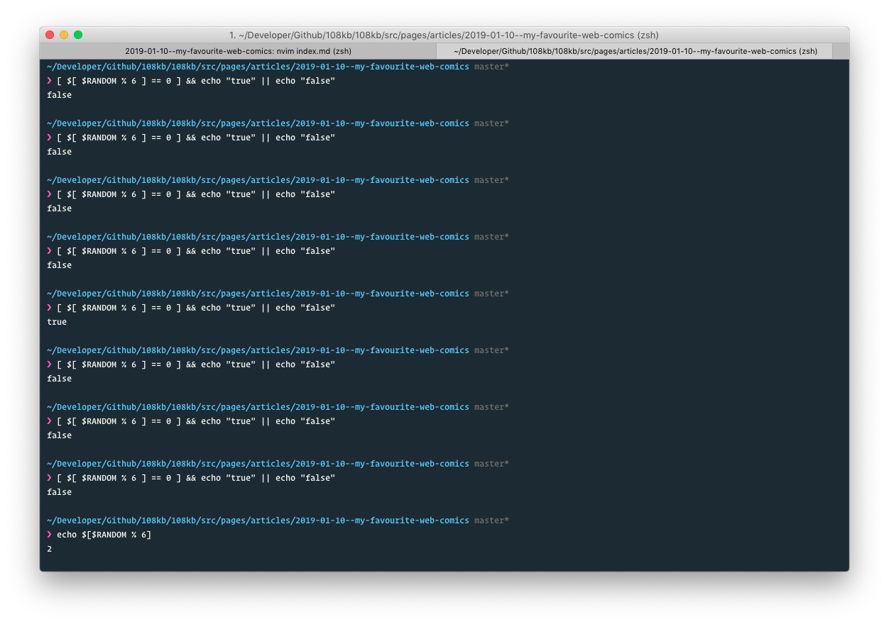

Gue suka membaca komik. Ketika masa-masa sekolah, gue suka membaca komik Detective Conan,
Yugioh, One Piece, dsb meskipun gue enggak suka dengan anime/manga. Just for fun aja.

Seiring bertambahnya umur, selera membaca komik gue ternyata menjadi berubah. Bila dulu
membaca komik agar mendapat hiburan saja, sekarang membaca komik sekaligus bisa mendapatkan
pengetahuan juga! Gue kadang-kadang aja membaca komik, biasanya ketika sedang malas membaca
tulisan-tulisan, tapi tetap ingin mempelajari sesuatu yang baru. Kalau sebagai _pelarian_
ketika sedang bosan sih biasanya gue lebih mencari cara _offline_ terlebih dahulu, karena
seringnya sumber dari "kebosanan" gue adalah ketika kelamaan berada didepan layar.

Oke, untuk mempercepat basa-basi ini, berikut komik-komik favorit gue yang gue bookmarks di
peramban gue.

## XKCD

Gue senangnya dengan XKCD adalah topik pembahasan yang dipilih biasanya sangat cerdas. Selain
itu, biasanya dia membuat komik yang membuat kita _berfikir_. Komik XKCD favorit gue salah satunya
adalah yang berjudul "Exploits of a Mom".

Komik diatas menurut gue lucu tapi cerdas sih. Meskipun kasus diatas sangat bakal 'jarang' banget
terjadi didunia nyata, tapi gue yakin mungkin ada beberapa yang tidak tau bahayanya
Sanitization alias **Never trust user input**.

## Commit Strip

Kalau CommitStrip asiknya dia terkadang membahas hal-hal yang sedang tren didunia "Programming", dan juga
komiknya full color! Ini salah satu komik favorit gue dari commitstrip "Russian roulette"

Entah kenapa gue ngerasa komik ini lucu aja, kebetulan gue ngerti apa yang dibahas. Plus, gue baru tau kalau
di ENV ternyata ada nilai dari `$RANDOM`

Dan menurut gue itu menghibur banget lah haha

## Monkey User

Ini juga hampir sama menurut gue seperti CommitStrip, bedanya dia karakternya "Stick man" (kek si XKCD)

Image above is obviously true.

## turnoff.us

Kalau ini pembahasannya lebih universal, tapi rata-rata yang gue dapet "jokes" nya lebih tinggi dari komik-komik lainnya.

Ini goblok banget enggak, sih? Haha. Sad, but true. Buat penggemar & suka ngikutin berita-berita crypto (I'm not that guy, ok?)
mungkin pernah dengar tentang [Lightning Network](https://lightning.network/) yang membuat transaksi dibitcoin menjadi cepat
(karena yang dulu digembor-gemborkan fitur "pengiriman uang dengan cepat" nya sudah hilang, kan? Menjadi "pengiriman uang dengan
biaya kecil". Btw, ini teman kantor gue sampai "niat" ingin membuat layer diatas bitcoin untuk "mempercepat" transaksi dibitcoin tersebut,
terniat! Tapi gue bukan seorang _crypto guy_ ya

## Invisible Bread

Ini juga gue baru tau komiknya, dan menurut gue cerdas dan lucu juga.

Hahaha humor gue gini banget dah

---

Nah itulah web komik yang gue bookmark. Gue enggak membaca komik di Line Webtoon, selain karena "Biar apa?" juga gue males karena
rata-rata topiknya membahas tentang "Percintaan" atau gak "Horror". Kalau tentang percintaan, mending sekalian baca novel yang romantis,
kalau tentang horror, mending sekalian nonton film yang serem.

Atau ngeliat isi dompet aja.

Atau melihat instagram story dia ketika sedang bersama seorang pria.

Bangs, sabar riz.

Oke, apakah kalian memiliki Web Comic favorit kalian juga, atau tidak? Atau ada yang tidak gue sebutin diatas? Silahkan dikomentari, karena
tadi siang gue udah benerin kolom komentar nya hahahanying.
