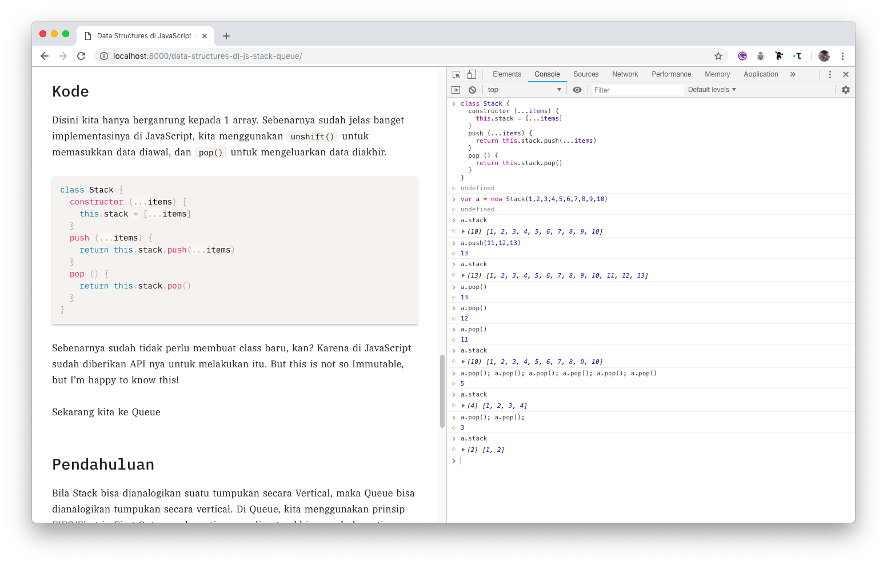
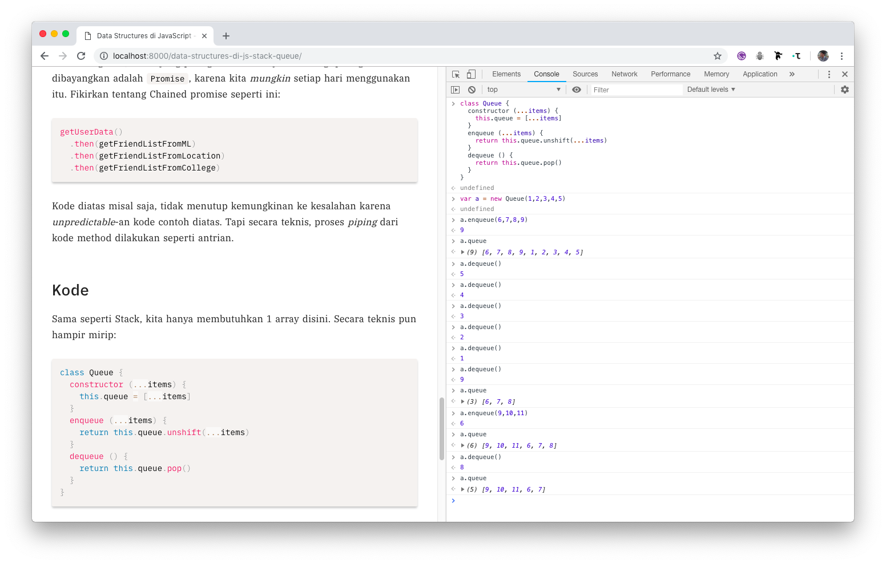

Daripada boring ingin melakukan apa, gue ingin mencoba memahami Data Structures menggunakan JavaScript. Meskipun gue
sedang mempelajari tentang Functional Programming, sepertinya mempelajari terlebih dahulu tentang data structure berguna
juga. Sebelumnya, gue merasa data structure ini enggak terlalu berguna (terlebih karena diajarin di kampus nya kurang
jelas), karena _gue ini Frontend Engineer, ngapain juga memahami data structure? Toh yang gue buat adalah UI_, dan itu
asumsi gue dulu, ternyata setelah difikir-fikir data structure juga bisa kita terapkan ketika mengembangkan sebuah
aplikasi disisi Frontend.

Sebagai permulaan, kita mulai dari Stacks. Dari namanya pun sudah jelas, bahwa Stack merupakan sebuah tumpukan. Dan
tumpukan terjadi untuk tipe data larik/susunan/array. Mungkin kita sudah biasa untuk tidak memikirkan proses rumitnya,
contoh seperti Promise. Kita lebih suka untuk "menggunakan public API", karena memang itulah seharusnya yang kita
lakukan. Sebelum kita ke studi kasus, mari kita pahami terlebih dahulu apa itu Stack.

## Pendahuluan

Sebenarnya sudah jelas tentang apa itu Stack, yaitu tumpukan. Silahkan kalian tumpuk uang/apapun itu, dan itulah data
struktur dari stack. Stack memiliki 2 prinsip: LIFO/Last in First out. Mari kita analogikan dengan mencuci piring.

```
[piring a]
[piring b]
[piring c]
[piring d]
```

Ingat prinsip LIFO? Yang terakhir dimasukkanlah yang dikeluarkan duluan:

```diff
+[piring e]
[piring a]
[piring b]
[piring c]
[piring d]

// [e,a,b,c,d,e]
```

Setelahnya:

```diff
-[piring e]
[piring a]
[piring b]
[piring c]
[piring d]

// [a,b,c,d,e]
```

Masih lanjut:

```diff
-[piring e]
-[piring a]
[piring b]
[piring c]
[piring d]

// [b,c,d,e]
```

Jika difikir-fikir, proses ini seperti singkronous tapi tidak mem-block operasi selanjutnya. Tingkat prioritas suatu
operasi, disusun berdasarkan operasi terakhir. Mungkin bisa dianalogikan dalam membuat sebuah aplikasi TODO List:

## Use Case

List kosong. Lalu kita tambahkan list: Beli nasi goreng, beli kerupuk, beli susu.

Lalu kita teringat bahwa kita belum ngambil uang di ATM, lalu kita tambahkan daftar: Ambil uang di Atm. Maka, daftar
pekerjaan yang akan dikerjakan adalah ambil uang, beli nasgor, kerupuk, terus susu. Dan beli kerupuk akan "ketunda"
lagi, ketika kita menambahkan daftar baru.

## Real Case

Bisa gue asumsikan ketika kita membuat sebuah Editor. Anggap editor state kita begini:

```javascript
const state = [
  "Bisa gue asumsikan",
  "ketika kita membuat sebuah",
  "Editor"
]
```

Enggak mungkin kan ketika kita trigger `CMD+Z` atau `CTRL+Z` Jadinya seperti ini:

```
Bisa gue asumsikan ketika kita membuat sebuah Edito
```

Bukan seperti ini:

```
Bisa gue asumsikan ketika kita membuat sebuah
```

Karena pada dasarnya, "Undo" merupakan penggagalan *aksi terakhir yang dilakukan*. Cocok untuk penggunaan data structure Stack disini.

## Kode

Disini kita hanya bergantung kepada 1 array. Sebenarnya sudah jelas banget implementasinya di JavaScript, kita
menggunakan `unshift()` untuk memasukkan data diawal, dan `pop()` untuk mengeluarkan data diakhir.

```javascript

class Stack {
  constructor (...items) {
    this.stack = [...items]
  }
  push (...items) {
    return this.stack.push(...items)
  }
  pop () {
    return this.stack.pop()
  }
}

```

Sebenarnya sudah tidak perlu membuat class baru, kan? Karena di JavaScript sudah diberikan API nya untuk melakukan itu.
But this is not so Immutable, but I'm happy to know this!



Sekarang kita ke Queue

## Pendahuluan

Bila Stack bisa dianalogikan suatu tumpukan secara Vertical, maka Queue bisa dianalogikan tumpukan secara vertical. Di
Queue, kita menggunakan prinsip FIFO/First in First Out, yang berarti yang paling terakhir masuk, berarti yang paling
terakhir keluar.

## Use Case & Real Case

Ini sudah jelas banget sih, antrian. Lu coba ngantri dibank, yang paling terakhir ngantri, maka yang paling terakhir
dilayani. Analogi paling mudah dibayangkan adalah `Promise`, karena kita _mungkin_ setiap hari menggunakan itu. Fikirkan
tentang Chained promise seperti ini:

```js
getUserData()
  .then(getFriendListFromML)
  .then(getFriendListFromLocation)
  .then(getFriendListFromCollege)
```

Kode diatas misal saja, tidak menutup kemungkinan ke kesalahan karena _unpredictable_-an kode contoh diatas. Tapi secara
teknis, proses _piping_ dari kode method dilakukan seperti antrian.

## Kode

Sama seperti Stack, kita hanya membutuhkan 1 array disini. Secara teknis pun hampir mirip:

```js

class Queue {
  constructor (...items) {
    this.queue = [...items]
  }
  enqueue (...items) {
    return this.queue.unshift(...items)
  }
  dequeue () {
    return this.queue.pop()
  }
}

```

That's it.



Hmm, kok proses 'pelepasan' nya sama-sama menggunakan `pop` sih, riz? Ya memang kenapa? Ingat prinsip Stack adalah LIFO
dan Queue FIFO, kan? Bagaimana bila kita ingin nya mengeluarkan itemnya di awal saja? Oh jelas bisa, asal kita masih
mengikuti prinsip tersebut!

```js

class Stack {
  constructor (...items) {
    this.reverse = false
    this.stack = [...items]
  }
  push (...items) {
    return this.reverse ?
      this.stack.unshift(...items) :
      this.stack.push(...items)
  }
  pop () {
    return this.reverse ?
      this.stack.shift() :
      this.stack.pop()
  }
}

```

Logika nya sama saja, bedanya, bila yang pertama kita memasukkan item baru ke Stack dari atas, yang ini dari bawah. Dan,
proses nya pun berarti beda, kita ambilnya dari bawah dulu lalu keatas (sebelumnya yang stack dari atas kebawah kan?)

Mari kita coba!

```js

const stack = new Stack(1,2,3,4,5)
stack.reverse = true
stack.push(1337)
console.log(stack.stack) // [1337,1,2,3,4,5]
stack.pop()
console.log(stack.stack) // [1,2,3,4,5]
```

Sama aja, kan? Mau data baru disimpan diatas atau dibawah, intinya data pertama yang akan dikeluarkan adalah yang
terakhir dimasukkan.

Sekarang kita queue! Harusnya gampang juga sih:

```js
class Queue {
  constructor (...items) {
    this.reverse = false
    this.queue = [...items]
  }
  enqueue (...items) {
    return this.reverse ?
      this.queue.push(...items) :
      this.queue.unshift(...items)
  }
  dequeue (...items) {
    return this.reverse ?
      this.queue.shift() :
      this.queue.pop()
  }
}
```

Mau data baru tersebut disimpan diawal atau diakhir (kiri atau kanan), tetap data terakhir yang akan dikeluarkan adalah
yang paling awal berada diantrian. Jika direverse, bila sebelumnya kita memproses dari awal/kiri dulu, sekarang kita
proses nya dari akhir/kanan terlebih dahulu. Basically sama saja!

```js
const queue = new Queue(1,2,3,4,5)
queue.reverse = true
queue.enqueue(1337)
console.log(queue.queue) // [1,2,3,4,5,1337]
queue.dequeue()
console.log(queue.queue) // [2,3,4,5,1337]
```

What about Stack Overflow?

Stack Overflow merupakan kondisi dimana pemanggilan stack melebihi memori yang tersedia, yang menyebabkan program
tersebut crash. Banyak penyebab yang menimbulkan Stack Overflow/Buffer Overflow ini, seperti rekursif yang tidak ada
pernah selesainya misalnya. Di React pun ada kondisi dimana kita "meng-update" state terus-terusan dan React akan
memberikan error bahwa React membatasi proses pengubahan state yang bercabang untuk menghindari infinity loop.

Apakah Stack/Buffer overflow berhubungan dengan data struktur yang kita bahas tersebut? Oh jelas. Anggap kita melakukan
perulangan didalam penambahan stack:

```js
while (stackNotEmpty) {
  stack.pop() // remove current stack
  if (unexpectedTaskHappenHere) { // Let's say if `currentTaskFail`
    stack.push(handleThat) // add handler to the stack
  }
}

```

Misal kode diatas adalah fungsi untuk offline feature diaplikasi chat. Karena offline tapi si user mengirim pesan ke
seseorang, maka tidak mau kita harus mengirimnya ketika user tersebut sudah kembali online, kan?

Lalu flow nya adalah:

1. Kumpulkan chat yang dikirim beserta timestampnya
2. Lakukan sinkronisasi dengan server
3. Kirim satu-satu dan tetap verify berdasarkan hash
4. Terus lakukan sampai stack tersebut sudah tidak ada itemnya

Anggap dilangkah ke 3 ada error, bahwasannya ada pesan yang tidak ter-verify hashnya. Lalu kita membuat handlernya
adalah dengan mengulang langkah tersebut ke langkah pertama lagi. Terus-terusan aja stack tersebut dihapus &
ditambahkan lagi mungkin sampai item di stack `offlineSync` misalnya habis. Yang berarti akan menghabiskan memori,
syukur-syukur kalau ada fitur "Auto-crash".

Kondisi diatas cuma sebagai perumpamaan aja ya

What about Race Condition?

Ingetkan kalau di Queue data yang pertama masuk, berarti data yang pertama kali keluar adalah yang pertama diantrian
tersebut, kan? Pernah kepikiran enggak _bagaimana bila ada stuck diantrian tersebut?_

misal kondisi seperti ini:

```
lapar -> ngasih tau 'aku gak bakal makan sebelum kamu makan' -> makan -> kenyang 
```

Ternyata ada stuck di proses kedua, dan akhirnya bukannya makan lalu kenyang, malah mati :((

Kalo error mending kan bisa di `catch` misalnya kalau di `Promise`, ya kalo kagak error?

Race condition merupakan suatu kondisi dimana dua atau lebih proses bisa mengakses shared memory pada saat yang
bersamaan, sehingga hasil akhir tersebut bergantung kepada proses mana yang selesai dieksekusi duluan. Biasanya, kita
menggunakan Promise untuk menghindari Callback Hell. Ternyata, di Promise pun ada masalah juga. Misal aja ini mah,
bayangkan seperti ini:

```js
getUserData(userId)
  .then(user => {
    getFriendList(user.id)
      .then(friend => {
        friend.map(otherPeople => getFriendSuggestion(otherPeople.id))
      })
      .catch(err => console.error(err))
    })
    .then(otherSideEffect)
    .catch(err => console.error(err))
```

Mengapa kita menggunakan cara tersebut? Karena kita tidak ingin request data yang salah (misal fungsi `getFriendList`
sudah ter-eksekusi, sedangkan nilai dari `user.id` masih `undeifned`. Bagaimana bila ternyata proses stuck di
`getFriendList`, sehingga fungsi pemanggilan `otherSideEffect` tidak ter-panggil panggil karena `Promise` dari
`getFriendList` belum selesai? Sedangkan, fungsi `otherSideEffect` tidak bergantung dengan `getFriendList`?

Timeout jawabannya! Ya, tapi dimana?

Beruntung JavaScript menawarkan `Promise.race`, yakni sebuah method yang mengembalikan `resolve` atau `reject` dari
promise yang paling cepat ter-eksekusi. Berdasarkan contoh diatas, kita bisa membuat timeout misal 20 detik. Ketika
request di fungsi `getFriendList` tidak selesai selama 20 detik, maka bisa kita lanjutkan (dengan memaksa `resolve`
misalnya) agar fungsi di `otherSideEffect` bisa ter-eksekusi. 

Jadi, kalau dianalogikan makan diatas tersebut, menjadi seperti ini:

```
lapar -> ngasih tau 'aku gak bakal makan sebelum kamu makan' -> gue tunggu balesan sampe gue bener-bener laper -> laper
banget-> bodo amat makan aja ah -> kenyang 
```

Karena pada dasarnya kondisi kenyang tidak bergantung dengan kondisi dari jawaban 'aku gak bakal makan...' itu, kan?
Istilahnya: Kalau mau ya ayo, kalau gak yasudah.

_Kenapa kok harus sistematis gitu sih?_

Ya karena gak mungkin kan kita laper, terus kenyang tapi gak makan. Terus baru deh makan, gak logis haha.

## What I Learned?

Masih banyak struktur data lain yang belum gue bahas (dan akan gue bahas!) disini. Mungkin setelah ini ingin membahas
tentang Linked List, karena React Fiber menggunakan
[(Singly) Linked List](https://github.com/acdlite/react-fiber-architecture) dalam proses rendering.

Secara "UI/Frontend Development" mungkin kita tidak perlu mengetahui tentang Data Struktur ini, karena pada dasarnya
kita hanya menggunakan API yang sudah ada (_Seperti we know how to animate a dom using `fn.animate(...)` instead of
creating that `animate` function_). Itu sih menurut gue perbedaan "developer" dan "engineer" (meskipun gue pernah nulis
tentang perbedaan itu, yang entah benar/salah di Medium).

Gue benar-benar enggak ngerti banget ketika materi ini diajari dikampus, karena yaa meskipun ini termasuk Abstract Data
Type/ADT tapi setidaknya jangan dibahas secara abstrak juga lah. Alhamdulillah dengan seiring pengetahuan yang gue
semakin bertambah, gue bisa (semoga) *memahami* sendiri tentang ADT tersebut dengan cara gue sendiri, yang sekiranya
menurut gue akan terpakai untuk karir gue nanti.

Thanks for stopping by
