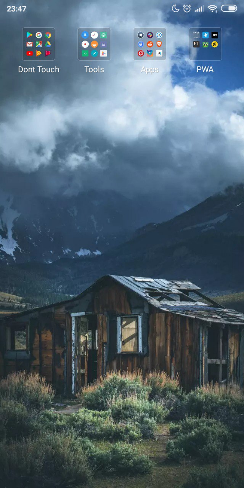
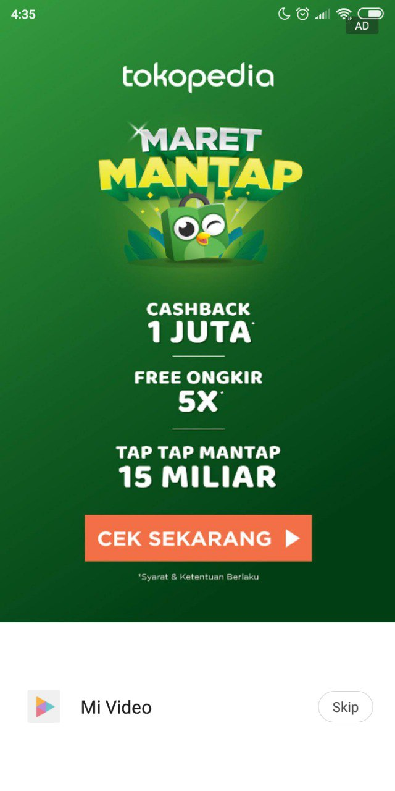
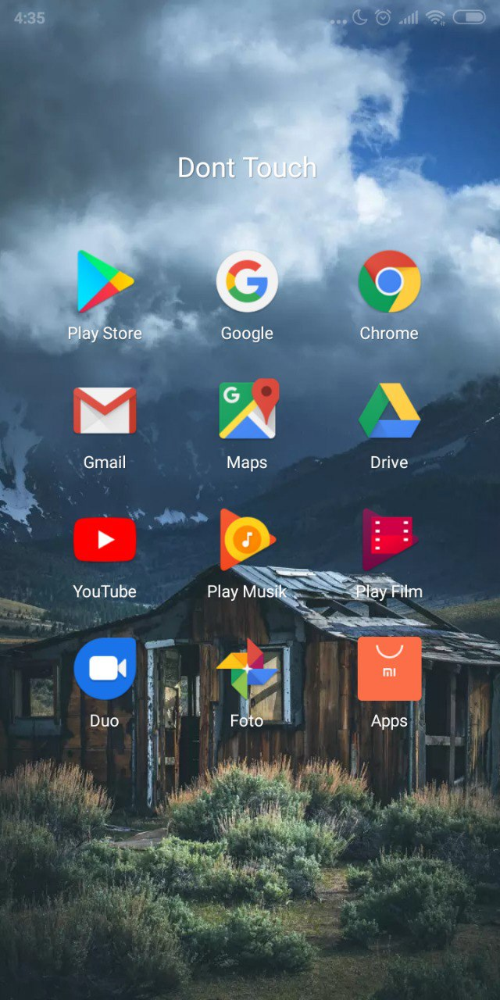
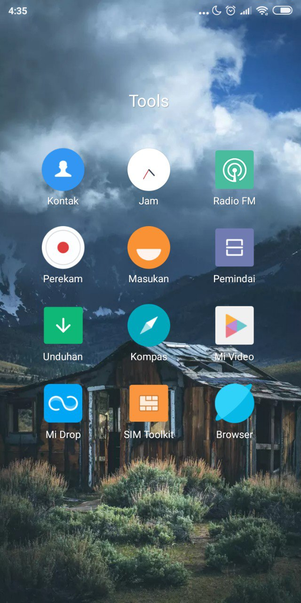
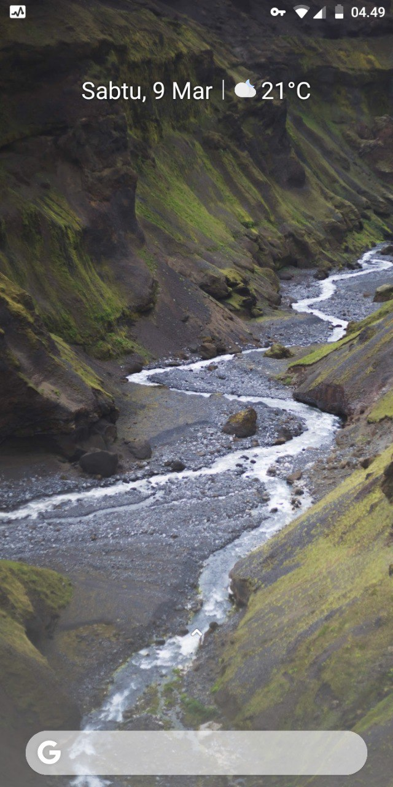
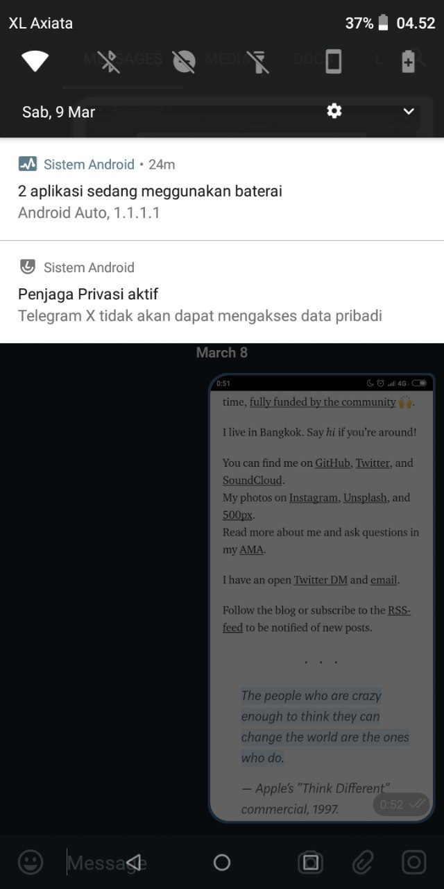
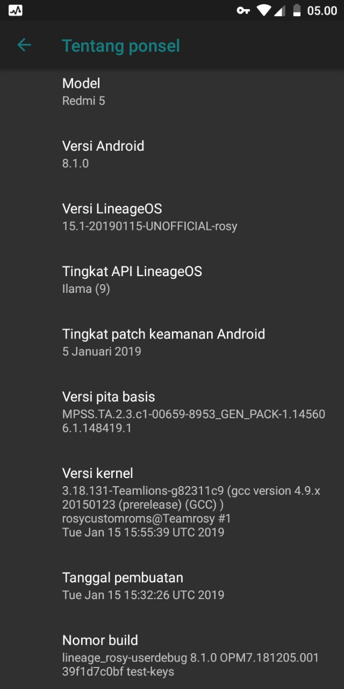
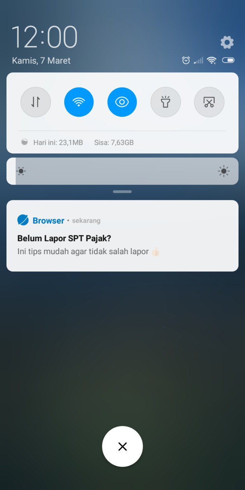
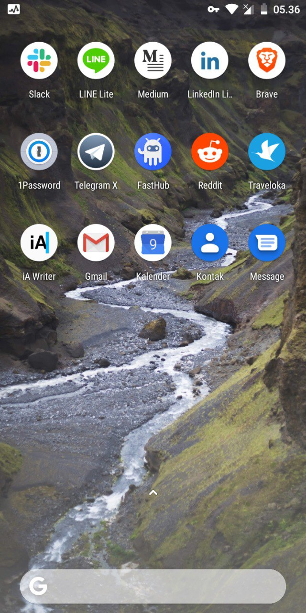

Sudah lama juga gue menggunakan Android, bahkan beban penggunaan aplikasi pun gue lempar ke android
gue daripada di aipon. Berawal membeli android hanya untuk menguji _Progressive Web Apps_, malah
jadi nyaman menggunakan Android.

Gue menggunakan Xiaomi Redmi 5. Orang miskin mah gak perlu yang aneh-aneh ya hp nya, cukup saomi
aja.

## MIUI is beautiful

Seriusan, dari sisi UI, UX, dan kegunaan, menurut gue udah pas banget. Ini kira-kira penampakan hp
gue:

Simple, kan?

## Something I hate from Xiaomi

Gue yakin Xiaomi jual hp murah karena alasan tertentu. Mereka mencari pemasukan dengan cara lain
selain menjual handphone yang mahal tapi powerful. Yakni, via iklan. Hal pertama yang gue malesin
dari xiaomi ini adalah IKLAN.

Layar diatas ketika gue membuka video yang dikirim oleh teman gue di Whatsapp dan gue save (ketika
masih pakai WA). Malesnya adalah aplikasi "bawaan" yang diinject iklan. Yang kedua, banyak
aplikasi-aplikasi "bawaan" yang enggak berguna. Dan gak bisa dihapus, ini penampakannya:

Untuk Google. Aplikasi google masih gue pakai lah dalam keseharian gue, dan ini yang bener-bener
jarang banget gue pakai:

Padahal, aplikasi-aplikasi yang gue pakai hanya ini:

Dan ini beberapa aplikasi "PWA" untuk eksperimen (yang ada di folder PWA)

## I trust nobody

Mungkin kalian sudah tau gue lah ya bahwa gue orangnya rada sensitif dengan privasi, dan juga gue
hampir susah banget percaya terhadap sesuatu. Ada beberapa alasan seputar Xiaomi ini yang gak bisa
gue sebut takut dianggap rasis, intinya: MIUI tidak Open Source. Lalu bisnis mereka salah satunya
juga menyangkut dengan iklan. Dan lo pasti paham maksud gue.

Sebagai seorang Advanced User, gue pun mulai mempertimbangkan untuk mengganti sistem operasi bawaan
dari Xiaomi ini dengan alternatif yang Open Source. Pilihan gue jatuh kepada [Lineage
OS](https://lineageos.org/).

## Meet LineageOS!

Meskipun sekarang hidup gue sudah terikat dengan layanan Google, tapi LineageOS membuat beberapa
masalah seputar privasi setidaknya menjadi terlihat lumayan aman. Sebelumnya gue menginstall
LineageOS dengan mode "Google-free", ternyata gue enggak nyaman. Jadi terpaksa gue install ulang
lagi dengan membawa layanan Google.

Berikut pratinjau dari hp gue yang sekarang:

Masih sama-sama clean, kan? Menggunakan Android Oreo (yang katanya _privacy nightmare_), dan
menggunakan LineageOS versi 15.

Bagaimana gue bisa berasumsi bahwa data pribadi gue aman? Ini:

Dan gue yakin, pengembang pasti enggak ngasal ngasih notifikasi "Aplikasi X tidak akan dapat
mengakses data pribadi blablabla...", pasti berdasarkan data dan algoritma kan?

Jika ingin melihat spec nya lebih lanjut, ini gambarnya:

Dan ya, support dark mode! Dark mode everywhere (dan so customizable anjir)

## Where is the freedom?

Pertama, aplikasi bawaan gak diatur oleh vendor dari hp gue. Video, Music, dsb. Tidak ada penampilan
iklan yang tidak bisa dikendalikan, dan tidak ada fitur yang tidak bisa dimatikan seperti si bangsat
ini:

Itu untung aja push notifnya rada manusiawi, kadang dia ngasih yang berbau bokep. Dan itu gak bisa
gue matikan fitur tersebut.

Juga, LineageOS Open Source. Kodenya bisa diaudit oleh siapapun.

Dan, mereka dibiayai oleh komunitas. Gue ngerti lah orang-orang yang seperti ini, mereka lebih
mengedepenkan idealisme dibanding pragmatisme.

Hampir semua fitur "handphone" berjalan dengan baik, tapi sayangnya fingerprint enggak support. Pas
googling sih harus ada konfig dikit, tapi karena gue lagi malesbanget jadi yaudah deh gini aja. Dan
karena menggunakan Android Oreo, tampilan pun sangat enak dipandang!

Aplikasi diatas adalah aplikasi-aplikasi yang gue pakai tiap hari. Lucu kan icon nya, beda banget
sama MIUI.

Meskipun masih terikat dengan Google, setidaknya sudah tidak terikat dengan vendor alias xiaomi.
Google Camera nya juga keren banget! Tampilan Gmail, opsi privasi, kustomisasi, pokoknya banyak deh
yang tidak ditawarkan oleh MIUI.

Gue gak bakal balik lagi ke MIUI. Dan fyi, hp gue enggak gue root.

## One more thing

Gue mencari alternatif dari Google Keyboard, karena you know lah. Pengennya aplikasi keyboard
tersebut Open Source, dan memang dibuat untuk alasan privasi. Kasih tau ya kalau ada rekomendasi.

Tertarik pindah juga?

Aipon gue tetep menggunakan iOS, karena gue tau bisnis apple bukan di iklan dan jual informasi. Ya,
hardware. So expensive. But worth.
